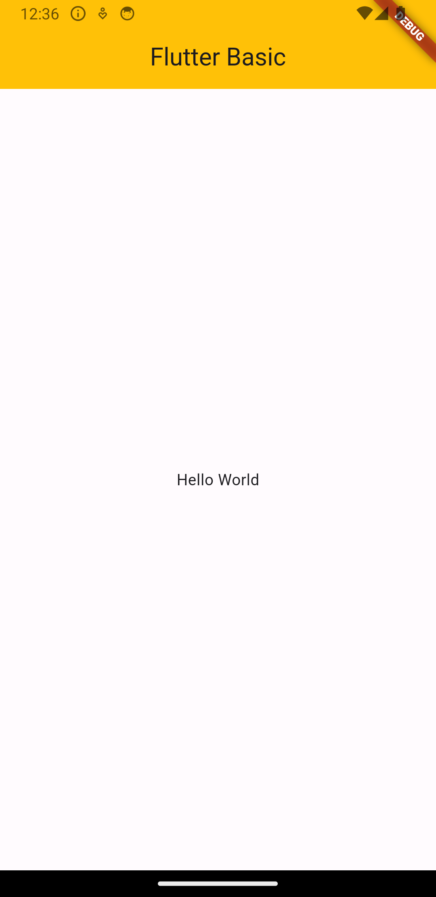
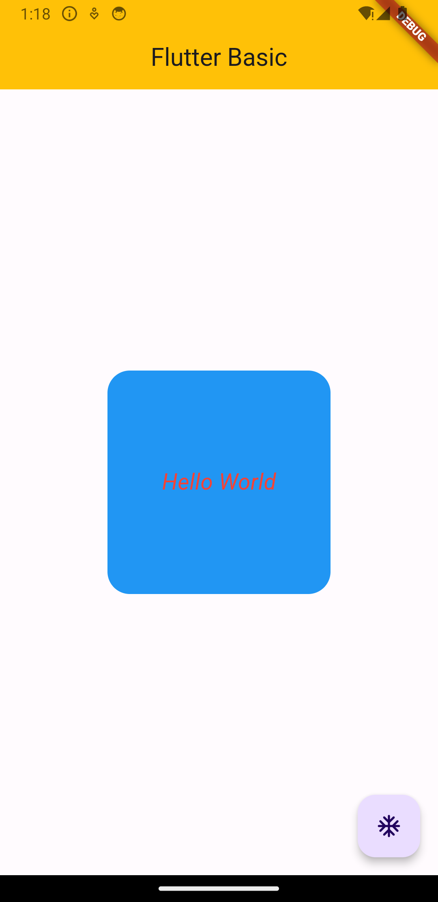
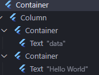

# Basic App

### Basic Scene
အကုန်လုံးက widget တွေဘဲ 
စစချင်းမှာ widget တွေခွဲမရေးဘဲ Scaffold ထဲထည့်ရေးလို့ရတယ်။ theme မှာ AppBar Theme ထည့်ပေးမှရမယ်။အရောင်က Scffold ထဲက 
```dart
import 'package:flutter/material.dart';

void main() {
  runApp(const MyApp());
}

class MyApp extends StatelessWidget {
  const MyApp({super.key});

  // This widget is the root of your application.
  @override
  Widget build(BuildContext context) {
    return MaterialApp(
      title: 'Flutter',
      theme: ThemeData(
        appBarTheme: const AppBarTheme(
          backgroundColor: Colors.amber,
        ),
      ),
      home: Scaffold(
        appBar: AppBar(
          title: const Text("Flutter Basic"),
        ),
        body: const Center(
          child: Text("Hello World"),
        ),
      ),
    );
  }
}

```
<br>

<div style="text-align:center;">
  
</div>
<br>

---


main function ထဲမှာ runApp function ခေါ်သုံးတယ်။
```dart
void main() {
  runApp(const MyApp());
}
```


MyApp က statless Widget Class အောက်မှာသုံးထားတယ်။


lib folder for code
test folder for testing codes

yaml ဖိုင်ထဲမှာ avoid_print ကို true false လုပ်ပြီး error ထိုးတာပိတ်ထားလို့ရတယ်။
pub spec yaml ထဲမှာ project နဲ့ဆိုင်တာတွေထည့်လို့ရတယ်။

`Scaffold` widget ထဲမှာ
* AppBar, Drawer, BottomNavigationBar, Floating Action Button, Background Color အစရှိသဖြင့်အကုန်ထည့်လို့ရတယ်။
* `debugShowCheckedModeBanner : false,` ဖျောက်လို့လည်းရမယ်။ Debug ဘားကို

```dart
 appBar: AppBar(
          centerTitle: true,
          title: const Text("Flutter Basic"),
        ),
```
အကုန်လုံးကိုပေါင်းပြီးတော့ Widget Tree လို့ခေါ်တယ်။
MyApp Widget ထဲ MaterialApp>Scaffold>appBar


* Widget တိုင်းမှာ build function ရှိတယ်။ 
* main component of widget
* အောက် widget သေးသေးလေးအကုန်စုပြီး MyApp() ဆိုတဲ့ widget ဖြစ်လာတာ။

### VsCode Snippet

|        | About            | Snippet |
|--------|------------------|---------|
| stless | stateless Widget |         |
| stful  | stateful Widget  |         |

- class တစ်ခုဆောက်ရင် constructor ပါမယ်။
- widget တွေတည်ဆောက်ဖို့ build method ပါမယ်။
- Container Widget ကနေစမယ်။
example
```dart
class CustomButtom extends StatelessWidget {
  const CustomButtom({super.key});

  @override
  Widget build(BuildContext context) {
    return const Placeholder();
  }
}
```

1. Widget တွေကိုလည်း Warp လုပ်ရင် vscode မီးလုံးပုံလေးကနေဘဲလုပ်မယ်။
2. အပြင်ကို Widget အနေနဲ့ပြန်ခွဲလုပ်ချင်ရင် Extract လုပ်လို့ရတယ်။
```dart
import 'package:flutter/material.dart';

void main() {
  runApp(const MyApp());
}

class MyApp extends StatelessWidget {
  const MyApp({super.key});

  // This widget is the root of your application.
  @override
  Widget build(BuildContext context) {
    return MaterialApp(
      title: 'Flutter',
      theme: ThemeData(
        appBarTheme: const AppBarTheme(
          backgroundColor: Colors.amber,
        ),
      ),
      home: const TitleApp(),
    );
  }
}

class TitleApp extends StatelessWidget {
  const TitleApp({
    super.key,
  });

  @override
  Widget build(BuildContext context) {
    return Scaffold(
      appBar: AppBar(
        centerTitle: true,
        title: const Text("Flutter Basic"),
      ),
      body: const Center(
        child: Text("Hello World"),
      ),  
    );
  }
}
```

<br> 

### Scaffold and Material App Widget

#### MaterialApp
* material design/theme ကိုအသုံးပြုထား။
* ဘာသာစကားတွေကိုသတ်မှတ်ပေးထားတယ်။
* navigation အတွက် မတူညီတဲ့ routes တွေကိုသတ်မှတ်ပေးထားတယ်။
Theme ပြောင်းမယ်ဆိုရင် 
```dart
 return MaterialApp(
      title: 'Flutter',
      theme: ThemeData(
        appBarTheme: const AppBarTheme(
          backgroundColor: Colors.amber,
        ),
      ),
      home: Scaffold(
        appBar: AppBar(
          centerTitle: true,
          title: const Text("Flutter Basic"),
        ),
        body: const Center(
          child: Text("Hello World"),
        ),  
      ),
    );
  }
  ```
  
  ThemeDataထဲမှာ စိတ်ကြိုက် overwriter လုပ်လို့ရတယ်။ Material အစား
  localize တို့ root တို့ထည့်လို့ရတယ်။
  MaterialApp အောက်မှာဘဲ
  `debugShowCheckedModeBanner : false,`
  
  
  [Material App Class](https://api.flutter.dev/flutter/material/MaterialApp-class.html) 


#### Scaffold
* Screen အတွက်လိုအပ်တဲ့ basic layout ကိုသတ်မှတ်ပေးတယ်။
* Background ကာလာသတ်မှတ်ပေးလို့ရတယ်၊
*  AppBar,Drawer, BottomNavigationBar, FloatingActionButton(FAB) အစရှိသဖြင့်သတ်မှတ်ပေးလို့ရတယ်။


Scaffold အောက်လိုချင်တဲ့ page တိုင်းအတွက် define လုပ်လို့ရတယ်။
Floating Action Button ဆိုပြီး debug console လေးဖော်မယ်။
```dart
  home: Scaffold(
        appBar: AppBar(
          centerTitle: true,
          title: const Text("Flutter Basic"),
        ),
       
        body: const Center(
          child: Text("Hello World"),
        ),
        
        floatingActionButton: FloatingActionButton(
        onPressed: () => debugPrint('clicked'),
        child: const Icon(Icons.ac_unit_rounded),
        ),
        
      ),
```


### Text
`Text()`  ထဲမှာဘဲလိုတာတွေရေးမယ်။ style ထဲမှာTextStyle widget ခေါ်ပြီးလိုတာတွေထပ်ထပ်ရေးနေမယ်။ color,fontSize, fontStyle အစရှိသဖြင့်
```dart
  child: Text(
            "Hello World",
            style: TextStyle(
                color: Colors.red, 
                fontSize: 20, 
                fontStyle: FontStyle.italic),
          )
```

Text ကိုစာသားပြည့်လို့အောက်ဆင်းချင်ရင် Flexible နဲ့ warp အုပ်လို့ရတယ်။ 
```dart
const Flexible(
child: Text('Max row'),
   ), 
```
နောက်ထပ် parameter တွေ
```dart
Text( 
'Lorem Ipsum is simply dummy text of the printing and ', 
// maxLines: 1, 
overflow: TextOverflow.ellipsis, 
), 
```

### Container


* Center က ဘယ် widget  ပေါ်မဆို Parent warp လုပ်ထားလို့ရတယ်။ အခြား Center လုပ်လို့ရတဲ့ widget တွေလည်းရှိတယ်။ Center Widget ကို ဘယ် widget နဲ့မဆို wrap လုပ်လို့ရတယ်။ 
* Text widget  မှာ paramter တွေထပ်ထည့်လို့ရတယ်။ 
* A widget that centers its child within itself
Container Widget က dynamic ဖြစ်လို့ const နဲ့ပေးလို့မရဘူး height ပေးရင်သိသာတယ်။  width နဲ့ height အပြည့်ယူပြီး boxDecoration နဲ့ အပြင်အဆင်ပြောင်းလို့ရတယ်။ boxDecoration သုံးလိုက်ရင် color သုံးလို့မရတော့ဘူး။ 
* Container က width အပြည့်ယူတယ်။အောက်ကဥပမာဆိုရင် Text ကိုအလယ်ပေးလိုက်ရင် width အပြည့်ယူသွားတယ်။ width ပေးပြီးပြန်ကန့်သတ်လို့ရတယ်။ 
* Container ထဲမှာ Container child ပေးရင် child **Container က parent Container ကိုအပြည့်ယူတယ်။** ထိန်းရင် Cetner widget wrap အုပ်ပြီးပေးလို့ရတယ်။ 
* Container ကို appearence ပြင်ချင်ရင် `boxDecoration` နဲ့ပြင်လို့ရတယ်။
```dart 
 body: Center(
          child: Container(
            height: 200,
            width: 200,
            decoration:  BoxDecoration(
              color: Colors.blue,
              borderRadius: BorderRadius.circular(20),
            ),
            child: const Center(
              child: Text(
                "Hello World",
                style: TextStyle(
                    color: Colors.red,
                    fontSize: 20,
                    fontStyle: FontStyle.italic),
              ),
            ),
          ),
        ),
```

<br>
<div style="text-align:center;">
  
</div>
<br>

---

### Column and Padding, SizedBox


Column ခွဲမယ်ဆိုရင်
* Container ထဲမှာ Child တစ်ခုကို Column အနေနဲ့ခွဲမယ်။ Column ထဲမှာ childeren တွေတန်းစီသွားမယ်၊
* Children တစ်ခုချင်းဆီမှာက Row Column စိတ်ကြိုက်ခွဲမယ်။ flex လိုထပ်ခွဲတာမျိုး
* Children ထဲမှာထပ်ပိုင်းချင်ရင် Column သုံး။
* စာဖတ်ရန်

* painting library - Dart API (flutter.dev)
* Layouts in Flutter | Flutter
BoxDecoration class - painting library - Dart API (flutter.dev)

#### Column
 Column က ထောင်လိုက် 
* MainAxis က အပေါ်အောက်။ y 
* CrossAxis ကအလျားလိုက်။ x

#### Row
Row က အလျားလိုက်။
* MainAxis က ထောင်လိုက်။ y  
* CrossAxis က အလျားလိုက်။ x

Row အတွက်
* MainAxis က horizonatal axis - x
* CrosssAxis က Vertical axis - y 

Container Colum အောက်မှာ child နှစ်ခုထပ်ထားမယ်။


code sample
```dart
 body: Container(
          height: 200,
          width: 200,
          decoration: BoxDecoration(
            color: Colors.blue,
            borderRadius: BorderRadius.circular(20),
          ),

          //Column Start
          child: Column(
            children: [
              //1st Container child
              Container(
                color: Colors.green,
                child: const Text("First Column Child"),
              ),

              //2nd Container child
              Container(
                decoration: BoxDecoration(
                  borderRadius: BorderRadius.circular(20),
                  color: Colors.blue,
                ),
                child: const Text(
                  "Second Column Child",
                  style: TextStyle(
                    color: Colors.red,
                    fontSize: 20,
                  ),
                ),
              )
            ],
          ),

        ),
```

ညှိမယ်ဆိုရင် အုပ်ထားတဲ့ Container ကို width မကန့်ထားဘူးဆိုရင် အပြည့်ယူတယ်။
```dart 

   child: Column(
            mainAxisSize: MainAxisSize.max,
            mainAxisAlignment: MainAxisAlignment.center,
            crossAxisAlignment: CrossAxisAlignment.start,
            children: [
             ///
            ],
          ),
```


### SizedBox

* SizedBox ကို Column တွေကြားထဲ Spacer အနေနဲ့သုံးလို့ရတယ်။
* width ကိုလည်းအပြည့်ယူလို့ရတယ်။ 
* Widget 2 ခုကြား Spacing သုံးချင်တယ်ဆိုရင် SizedBox သုံးတယ်
* Size တစ်ခုဘဲသတ်မှတ်ပေးထားတဲ့ box ,element နှစ်ခုကြား spacing placeholder အနေနဲ့လည်းသုံးလို့ရတယ်။ 


```dart
  Column(
        mainAxisSize: MainAxisSize.max,
        mainAxisAlignment: MainAxisAlignment.center,
        crossAxisAlignment: CrossAxisAlignment.start,
        children: [
          Container(
            ////
          ),

          const SizedBox(
            height: 20,
          ),

          Container(
            ///
          )
        ],
    ),
```

`mainAxisAlignment: MainAxisAlignment.spaceAround,` ဆိုရင် elment တစ်ခုအနေနဲ့ယူပြီးsizeBox ကိုပါထည့်တွက်ပြီးခြားပေးသွားလိမ့်မယ်။

### Row

code sample
```dart
   Row(
        mainAxisAlignment: MainAxisAlignment.center,
        children: [
          const Text("Freelancer"),

          const SizedBox(
            width: 10,
          ),

          Container(
            height: 20,
            width: 20,
            color: Colors.amber,
          ),
        ],
      ),
```

optional paramter တွေပေးလို့ရသေးတယ်။